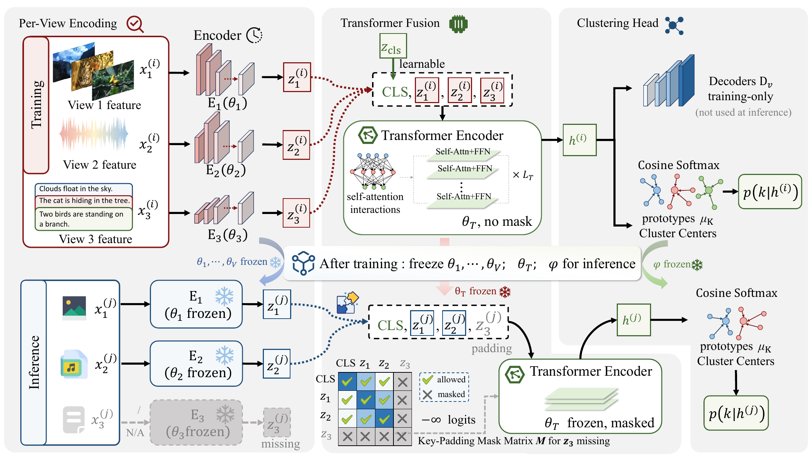

# CRAFT

**Beyond Missing Rates: Rethinking Incomplete Multi-View Clustering with Protocol Divergence**

Haolu Liu, Xiyue Wang, Xuanting Xie, Liangjian Wen, Zhao Kang

**NeurIPS 2026 · Poster**

[](https://arxiv.org/abs/2606.04857)
[](requirements.txt)

[Paper](https://arxiv.org/abs/2606.04857) · [Quick Start](#quick-start) · [Citation](#citation) · [imvc-audit Toolkit](https://github.com/dk23lhl/imvc-audit)

## Abstract

Incomplete multi-view clustering (IMVC) is typically evaluated by retraining separate models under different missing-view configurations. Evaluations indexed only by nominal missing rate can overlook differences in observation structure across missing-view protocols. We show that missing-data protocols with identical nominal missing rates can induce substantially different learning regimes, differing by approximately $50\times$ in the proportion of fully observed samples. We formalize this phenomenon as **protocol divergence**, which quantifies structural disparities among missing-view protocols beyond marginal missing rates. Furthermore, we analyze support-gated reconstruction mechanisms and show that their optimization contribution is inherently limited by the frequency of eligible observations under explicit normalization and optimization conditions. Based on these observations, we propose **CRAFT** (Co-occurrence-free Robust Attention-masked Fusion Transformer), a train-once framework that combines representation learning with an architecture designed to process missing-view inputs. CRAFT combines (i) per-sample forward computation using each sample's observed views and shared parameters, and (ii) mask-aware fusion over nonempty observed-view subsets. The deployment evaluation starts from training data with all views available and reuses one final checkpoint per dataset and seed across missing-view protocols without retraining. Experiments on CUB and MultiFashion show that CRAFT achieves the strongest performance in 12 out of 13 information-matched settings. Additional deployment experiments across seven benchmarks and sixteen missing configurations demonstrate substantial computational savings through checkpoint reuse while maintaining competitive clustering performance.

[](docs/assets/craft_architecture.png)

## Quick Start

### Installation

Python 3.10 and PyTorch 2.1.0.

```bash
git clone https://github.com/dk23lhl/CRAFT.git
cd CRAFT
python3.10 -m venv .venv
source .venv/bin/activate
python -m pip install "numpy<2" tensorboard -r requirements.txt
```

### Training

Two-stage training with attention masking on the bundled HandWritten dataset, using [this configuration](configs/train_mvc.yaml):

```bash
python main_mvc.py --config configs/train_mvc.yaml
```

Outputs: `outputs/CRAFT_MVC/quickstart_hw_s42/`. Keep `config.yaml` and `best.ckpt` together for evaluation.

### Evaluation

Evaluate Protocol 4 at nominal missing rate 0.5:

```bash
python incomplete_eval.py \
  --checkpoint outputs/CRAFT_MVC/quickstart_hw_s42/best.ckpt \
  --dataset handwritten --data_dir ./data \
  --mask_strategy attention_mask \
  --protocol cell_level --missing_rates 0.5 \
  --num_trials 1 --seed 42 \
  --output_dir outputs/CRAFT_MVC/quickstart_hw_s42/eval_p4_r05
```

ACC, NMI, ARI, and mask statistics are saved in `eval_p4_r05/four_protocol_eval_results.yaml` under the run directory.

For all four protocols and four nominal rates, use `--protocol all --missing_rates 0.1 0.3 0.5 0.7 --num_trials 5`.

## Citation

```bibtex
@inproceedings{liu2026beyond,
  title     = {Beyond Missing Rates: Rethinking Incomplete Multi-View Clustering with Protocol Divergence},
  author    = {Liu, Haolu and Wang, Xiyue and Xie, Xuanting and Wen, Liangjian and Kang, Zhao},
  booktitle = {Advances in Neural Information Processing Systems},
  year      = {2026},
  note      = {Accepted as a poster paper},
  url       = {https://arxiv.org/abs/2606.04857}
}
```

## Contact

[GitHub Issues](https://github.com/dk23lhl/CRAFT/issues) · [Zhao Kang](mailto:zkang@uestc.edu.cn)
